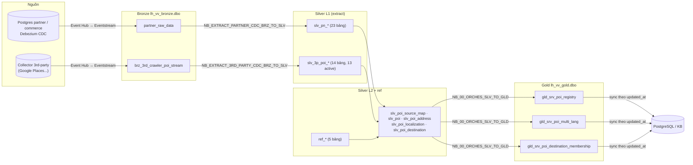

# 01 — Data Model mới của Visit Vietnam (POI) trên Microsoft Fabric

> Bộ context dùng chung cho người và agent. Cập nhật: 08/10/2026.
> Trạng thái số liệu: theo lần chạy gần nhất có log (extract rerun 04/10, gold run 1 ngày 05/10). Số liệu thay đổi theo dữ liệu nguồn; muốn số mới nhất thì chạy script chỉ đọc `CHECK_CTRL_SNAPSHOT.py` (kèm bộ này).
> Nguồn gốc: `claude/GOLD_POI_FLOW_DESIGN.md`, `claude/POI_3P_EXTRACT_REDESIGN.md`, `claude/PARTNER_EXTRACT_REDESIGN.md`, `notebooks/NB_CREATE_DDL.ipynb`.

## 1. Bối cảnh nền tảng

| Hạng mục | Giá trị |
|---|---|
| Nền tảng | Microsoft Fabric, mỗi môi trường (dev, stg, prod) 1 capacity **F16**, dùng chung với Eventstream, Copy Job, SQL endpoint, pipeline khác |
| Lưu trữ | 3 Lakehouse medallion trong cùng workspace: `lh_vv_bronze`, `lh_vv_silver`, `lh_vv_gold`, cộng lakehouse control `lh_vv_ctrl` (schema `dbo`). Không dùng Warehouse |
| Xử lý | Notebook PySpark / Spark SQL, Spark Runtime **1.3** (Delta 3.2); điều phối bằng Data Pipeline |
| Nạp dữ liệu | Event Hub → Eventstream → bronze (append) |
| Quy mô | ~100k POI mục tiêu (3rd-party hiện 19.046 địa điểm / 21.168 tài liệu raw), ~10k event / ngày, SLA nguồn → serving 30–60 phút |
| Tiêu thụ | Đồng bộ gold → PostgreSQL backend (theo `updated_at`), Knowledge Base (KB) |
| Ràng buộc | Không có quyền tạo Service Principal; không xoá file trong shortcut OneLake; giữ bảng `poi_*` cũ và chuỗi NB_00 cũ chạy song song tới khi cutover; không tạo schema mới nếu không có lý do thuyết phục |

## 2. Nguyên tắc phân tầng (đã chốt)

| Tầng | Vai trò | Được làm | Không làm |
|---|---|---|---|
| **Bronze** (`lh_vv_bronze.dbo`) | Dữ liệu thô đúng như nguồn gửi | Append từ Eventstream | Không sửa, không xoá |
| **Silver L1 — extract** (`lh_vv_silver.dbo.slv_pn_*`, `slv_3p_*`) | Đưa payload về bảng đúng cấu trúc nguồn, chuẩn kiểu, khoá | Parse JSON, chuyển kiểu theo cấu hình, khử trùng event, MERGE theo khoá, xoá mềm (CDC) | Không rule nghiệp vụ, không canonical, không gate |
| **Silver L2 — tích hợp** (`lh_vv_silver.dbo.slv_poi_*`) | Mọi quyết định nghiệp vụ dùng chung | Định danh, phân loại, chuẩn hoá địa chỉ, chọn tên / mô tả, slug, destination, cờ đủ ngôn ngữ | Không "serving zone" hình dáng theo consumer |
| **Ref** (`lh_vv_silver.dbo.ref_*`) | Rule dạng dữ liệu, sửa tay | 1 dòng = 1 rule; sửa = commit đổi dữ liệu → luồng tự tính lại | Không rule viết cứng trong code |
| **Gold** (`lh_vv_gold.dbo.gld_srv_*`) | Chỉ đồng bộ / phơi ra | Join theo khoá, gom, tính `row_hash`, lọc theo cờ silver | Không xử lý nghiệp vụ; gold không đọc gold khác |
| **Ctrl** (`lh_vv_ctrl.dbo.ctrl_*`) | Cấu hình + trạng thái + log | Xem `CTRL_TABLES_CONTEXT.md` | — |

Quy tắc phụ:
- Gold phụ thuộc gold khác → logic đó phải thành bảng silver L2 có nghĩa, dùng lại được.
- Silver có thể 1–1 với gold nhưng không bắt buộc.
- Bảng `lh_vv_bronze.partner.*` cũ (đã xử lý, không phải raw) chuyển sang silver (`slv_pn_*`).

## 3. Sơ đồ tổng

| Pipeline | Nhịp | Notebook | Đọc → Ghi |
|---|---|---|---|
| `PL_VV_TRANSFORM_BRONZE_TO_SILVER_FL_00` | 10–15 phút | `Get_Config_4Run` lọc `src_tbl = 'partner_raw_data'` + `Lookup_WM` → `ForEach_Source` (tuần tự) → Get Metadata `_delta_log` → `If_HasWork` → activity `NB_EXTRACT_PARTNER_CDC_BRZ_TO_SLV`. Tham số gắn cứng `partner_raw_data`. Không có Switch và không gọi notebook 3rd-party | bronze `partner_raw_data` → `slv_pn_*` |

## 4. Bronze — bảng raw

| Bảng | Nguồn | Cột chính | Đặc điểm |
|---|---|---|---|
| `lh_vv_bronze.dbo.partner_raw_data` | Debezium CDC (connector `dev_cdc` 3.0.0.Final, db `partner`, `commerce`) | `before`, `after`, `source` (JSON chuỗi), `op` (`c` / `r` / `u` / `d` / `t` / `m`), `EventProcessedUtcTime` | Append-only do Eventstream ghi; **không có stats** trong `_delta_log` (20.431 file / 3,2 GB lúc đo 02/10) → không lọc theo thời gian được, phải đọc theo version. 1 event = 1 thay đổi của 1 dòng của 1 bảng Postgres (`source.schema`, `source.table`) |
| `lh_vv_bronze.dbo.brz_3rd_crawler_poi_stream` | Collector 3rd-party | `event_id`, `source_name`, `source_id`, `crawled_at`, `ingested_date`, `normalized_payload`, `raw_payload`, `language_code` (tất cả STRING) | 1 event = 1 tài liệu đầy đủ (snapshot) lúc crawl. Không có tín hiệu xoá, không TOAST. DDL tương đương bảng raw 3P trước đó |
| `lh_vv_bronze.dbo.brz_watermark`, `brz_pipeline_run` | — | — | Thuộc chuỗi NB_00 cũ; luồng mới không đọc / ghi |

### Cấu trúc `normalized_payload`

Suy ra từ 1 dòng mẫu, không phải hợp đồng schema. `normalized_payload` và `raw_payload` là chuỗi JSON. Bảng dưới chỉ ghi khóa và kiểu JSON của object đã parse từ `normalized_payload`. `raw_payload` là JSON string, không khai triển.

| path | JSON type | element / note |
|---|---|---|
| `$` | object |  |
| `source_id` | string |  |
| `source` | string |  |
| `poi_name` | string |  |
| `poi_name_normalized` | string |  |
| `business_sector` | string |  |
| `business_category` | string |  |
| `subcategory_tags` | array | string |
| `types` | array | string |
| `operating_status` | string |  |
| `partner_id` | null |  |
| `slug` | null |  |
| `slug_history` | null |  |
| `price_level` | null |  |
| `star_rating` | null |  |
| `accommodation_type` | null |  |
| `country_code` | string |  |
| `language_code` | string |  |
| `created_at` | string |  |
| `awards` | null |  |
| `poi_address` | object |  |
| `poi_address.full_address` | string |  |
| `poi_address.house_number` | null |  |
| `poi_address.street` | null |  |
| `poi_address.ward` | string |  |
| `poi_address.district` | string |  |
| `poi_address.city` | string |  |
| `poi_address.country` | string |  |
| `poi_address.country_code` | string |  |
| `poi_address.postal_code` | string |  |
| `poi_address.lat` | number |  |
| `poi_address.lng` | number |  |
| `poi_address.plus_code` | string |  |
| `poi_address.timezone` | string |  |
| `poi_address.address_line1` | string |  |
| `poi_address.address_line2` | string |  |
| `poi_address.state_province` | string |  |
| `poi_address.short_address` | string |  |
| `poi_address.address_google` | string |  |
| `poi_address.address_viet_map` | string |  |
| `poi_address.vietmap_status` | string |  |
| `poi_address.vietmap_message` | null |  |
| `poi_rating` | object |  |
| `poi_rating.rating_overall` | number |  |
| `poi_rating.rating_count` | number |  |
| `poi_rating.rating_breakdown` | null |  |
| `poi_rating.sub_ratings` | null |  |
| `poi_contact` | object |  |
| `poi_contact.phone` | string |  |
| `poi_contact.phone_raw` | string |  |
| `poi_contact.website_url` | null |  |
| `poi_contact.google_maps_url` | string |  |
| `poi_contact.social_links` | null |  |
| `poi_contact.delivery_links` | null |  |
| `poi_contact.booking_links` | null |  |
| `poi_amenity` | object |  |
| `poi_amenity.ext_attributes` | object | <dynamic-key>: string |
| `poi_amenity.amenity_schema` | object |  |
| `poi_amenity.amenity_schema.facilities` | object |  |
| `poi_amenity.amenity_schema.facilities.type` | string |  |
| `poi_amenity.amenity_schema.facilities.required` | string |  |
| `poi_amenity.amenity_schema.facilities.main_cuisine` | object |  |
| `poi_amenity.amenity_schema.facilities.main_cuisine.type` | string |  |
| `poi_amenity.amenity_schema.facilities.main_cuisine.required` | string |  |
| `poi_amenity.amenity_schema.facilities.main_cuisine.multiple_lang` | boolean |  |
| `poi_amenity.amenity_schema.facilities.main_cuisine.enum` | array | string |
| `poi_amenity.amenity_schema.facilities.specialty_tags` | object |  |
| `poi_amenity.amenity_schema.facilities.specialty_tags.type` | string |  |
| `poi_amenity.amenity_schema.facilities.specialty_tags.required` | string |  |
| `poi_amenity.amenity_schema.facilities.specialty_tags.item_type` | string |  |
| `poi_amenity.amenity_schema.facilities.specialty_tags.multiple_lang` | boolean |  |
| `poi_amenity.amenity_schema.facilities.specialty_tags.enum` | array | string |
| `poi_amenity.amenity_schema.facilities.space_and_services` | object |  |
| `poi_amenity.amenity_schema.facilities.space_and_services.type` | string |  |
| `poi_amenity.amenity_schema.facilities.space_and_services.required` | string |  |
| `poi_amenity.amenity_schema.facilities.space_and_services.item_type` | string |  |
| `poi_amenity.amenity_schema.facilities.space_and_services.multiple_lang` | boolean |  |
| `poi_amenity.amenity_schema.facilities.space_and_services.enum` | array | string |
| `poi_amenity.amenity_schema.facilities.additional_amenities` | object |  |
| `poi_amenity.amenity_schema.facilities.additional_amenities.type` | string |  |
| `poi_amenity.amenity_schema.facilities.additional_amenities.required` | string |  |
| `poi_amenity.amenity_schema.facilities.additional_amenities.item_type` | string |  |
| `poi_amenity.amenity_schema.facilities.additional_amenities.multiple_lang` | boolean |  |
| `poi_amenity.amenity_schema.facilities.additional_amenities.enum` | array | string |
| `poi_amenity_schema` | null |  |
| `facilities` | object |  |
| `facilities.type` | string |  |
| `facilities.required` | string |  |
| `facilities.main_cuisine` | object |  |
| `facilities.main_cuisine.type` | string |  |
| `facilities.main_cuisine.required` | string |  |
| `facilities.main_cuisine.multiple_lang` | boolean |  |
| `facilities.main_cuisine.enum` | array | string |
| `facilities.specialty_tags` | object |  |
| `facilities.specialty_tags.type` | string |  |
| `facilities.specialty_tags.required` | string |  |
| `facilities.specialty_tags.item_type` | string |  |
| `facilities.specialty_tags.multiple_lang` | boolean |  |
| `facilities.specialty_tags.enum` | array | string |
| `facilities.space_and_services` | object |  |
| `facilities.space_and_services.type` | string |  |
| `facilities.space_and_services.required` | string |  |
| `facilities.space_and_services.item_type` | string |  |
| `facilities.space_and_services.multiple_lang` | boolean |  |
| `facilities.space_and_services.enum` | array | string |
| `facilities.additional_amenities` | object |  |
| `facilities.additional_amenities.type` | string |  |
| `facilities.additional_amenities.required` | string |  |
| `facilities.additional_amenities.item_type` | string |  |
| `facilities.additional_amenities.multiple_lang` | boolean |  |
| `facilities.additional_amenities.enum` | array | string |
| `poi_media` | array | object |
| `poi_media[].media_id` | string |  |
| `poi_media[].photo_api_uri` | string |  |
| `poi_media[].original_url` | string |  |
| `poi_media[].thumbnail_url` | string |  |
| `poi_media[].blob_url` | string |  |
| `poi_media[].media_type` | string |  |
| `poi_media[].category` | string |  |
| `poi_media[].is_blessed` | boolean |  |
| `poi_media[].display_order` | number |  |
| `poi_media[].photographer` | string |  |
| `poi_media[].width_px` | null |  |
| `poi_media[].height_px` | null |  |
| `poi_media[].file_size_bytes` | number |  |
| `poi_media[].caption` | null |  |
| `poi_media[].license` | string |  |
| `poi_media[].processing_status` | string |  |
| `poi_price` | null |  |
| `poi_content` | null |  |
| `poi_review` | array | object |
| `poi_review[].author_name` | string |  |
| `poi_review[].rating` | number |  |
| `poi_review[].text` | string |  |
| `poi_review[].time` | string |  |
| `poi_review[].source` | string |  |
| `poi_opening_hours` | object |  |
| `poi_opening_hours.open_now` | boolean |  |
| `poi_opening_hours.is_24_7` | boolean |  |
| `poi_opening_hours.is_temporarily_closed` | boolean |  |
| `poi_opening_hours.periods` | array | object |
| `poi_opening_hours.periods[].close_hour` | number |  |
| `poi_opening_hours.periods[].close_day` | number |  |
| `poi_opening_hours.periods[].open_hour` | number |  |
| `poi_opening_hours.periods[].close_minute` | number |  |
| `poi_opening_hours.periods[].open_minute` | number |  |
| `poi_opening_hours.periods[].day_of_week` | number |  |
| `poi_opening_hours.weekday_text` | array | string |
| `poi_opening_hours.secondary_hours` | array | object |
| `poi_opening_hours.secondary_hours[].periods` | array | object |
| `poi_opening_hours.secondary_hours[].periods[].close_hour` | number |  |
| `poi_opening_hours.secondary_hours[].periods[].close_day` | number |  |
| `poi_opening_hours.secondary_hours[].periods[].open_hour` | number |  |
| `poi_opening_hours.secondary_hours[].periods[].close_minute` | number |  |
| `poi_opening_hours.secondary_hours[].periods[].open_minute` | number |  |
| `poi_opening_hours.secondary_hours[].periods[].day_of_week` | number |  |
| `poi_opening_hours.secondary_hours[].weekday_text` | array | string |
| `poi_opening_hours.secondary_hours[].type` | string |  |
| `policies` | null |  |
| `extra_info` | object |  |
| `poi_id` | string |  |

## 5. Silver L1 — extract (đúng cấu trúc nguồn)

### 5.1 Partner `slv_pn_*` (23 bảng, `load_mode = CDC`)

Ghi bởi `NB_EXTRACT_PARTNER_CDC_BRZ_TO_SLV`. 1 dòng = 1 dòng bảng Postgres (bản mới nhất). Cột lấy từ `ctrl_cfg_schema_registry` (301 cột). Cột kỹ thuật: `deleted` (xoá mềm khi `op = d`), `_ingested_at`, `_source_db`.

| Bảng | Khoá | Số cột | Cột TOAST | Wave |
|---|---|---|---|---|
| `slv_pn_products` | `id` | 10 | 3 | 2 |
| `slv_pn_product_translations` | `id` | 7 | 1 | 2 |
| `slv_pn_product_attributes` | `id` | 8 | 1 | 2 |
| `slv_pn_product_attribute_translations` | `id` | 6 | 0 | 2 |
| `slv_pn_product_attribute_values` | `id` | 7 | 1 | 2 |
| `slv_pn_product_attribute_value_translations` | `id` | 4 | 0 | 2 |
| `slv_pn_product_variants` | `id` | 9 | 2 | 2 |
| `slv_pn_product_variant_translations` | `id` | 6 | 0 | 2 |
| `slv_pn_product_business_service_relation` | `id` | 5 | 0 | 2 |
| `slv_pn_product_posts` | `id` | 19 | 6 | 2 |
| `slv_pn_product_post_translations` | `id` | 15 | 5 | 2 |
| `slv_pn_partners` | `id` | 30 | 6 | 1 |
| `slv_pn_business_services` | `id` | 28 | 10 | 1 |
| `slv_pn_business_locations` | `id` | 12 | 3 | 1 |
| `slv_pn_hotel_room_types` | `id` | 25 | 4 | 1 |
| `slv_pn_hotel_rate_plans` | `id` | 19 | 3 | 1 |
| `slv_pn_business_service_i18ns` | (`business_service_id`, `locale`) | 12 | 8 | 1 |
| `slv_pn_business_service_poi_link` | `id` | 6 | 0 | 1 |
| `slv_pn_orders` | `id` | 13 | 2 | 1 |
| `slv_pn_order_refs` | `id` | 11 | 2 | 1 |
| `slv_pn_order_item_tickets` | `order_ref_id` (1 đơn có nhiều vé) | 15 | 1 | 1 |
| `slv_pn_order_item_hotels` | `order_id` (**chưa xác nhận PK**, K1) | 12 | 1 | 1 |
| `slv_pn_order_item_flights` | `order_id` (**chưa xác nhận PK**, K1) | 22 | 2 | 1 |

Ghi chú dữ liệu (rerun 04/10): 11 bảng (`products`, 9 bảng `product_*`, `order_item_flights`) có `after = ''` ở 100% event → NO_DATA / reject; `business_locations`, `product_post_translations` không có event nào trong raw. Chi tiết: `99_PAIN_POINTS.md`.

### 5.2 3rd-party `slv_3p_poi_*` (14 bảng, 13 active, snapshot)

Ghi bởi `NB_EXTRACT_3RD_PARTY_CDC_BRZ_TO_SLV`. Cột kỹ thuật: `_crawled_at`, `_event_id`, `_first_seen_at`, `_last_seen_at`, `_ingested_at`. Không có nhánh xoá; bảng con chỉ upsert, `_last_seen_at` cho biết lần cuối thấy. Registry 182 cột (146 bật, 36 tắt vì luôn null).

| Bảng | load_mode | Khối nguồn (`src_object`) | Khoá | Cột (bật) | Số dòng lần FULL 04/10 |
|---|---|---|---|---|---|
| `slv_3p_poi` | DOC | `$` (gốc payload) | `poi_id` | 23 (17) | 21.168 tài liệu → 19.046 địa điểm |
| `slv_3p_poi_address` | DOC | `poi_address` | `poi_id` | 21 (20) | — |
| `slv_3p_poi_contact` | DOC | `poi_contact` | `poi_id` | 8 (5) | — |
| `slv_3p_poi_price` | DOC | `poi_price` | `poi_id` | 5 (5) | 9.726 |
| `slv_3p_poi_opening_hours` | DOC | `poi_opening_hours` | `poi_id` | 6 (6) | 17.829 |
| `slv_3p_poi_policy` | DOC | `policies` | `poi_id` | 2 (2) | **tắt** (`is_active = 0`, khối luôn null) |
| `slv_3p_poi_rating` | DOC | `poi_rating` | `poi_id` | 5 (3) | — |
| `slv_3p_poi_amenity` | DOC | `poi_amenity` | `poi_id` | 41 (29) | — |
| `slv_3p_poi_raw_data` | DOC | `raw_data` | `poi_id` | 2 (2) | 8.199 |
| `slv_3p_poi_content` | DOC_ARRAY | `poi_content` | (`poi_id`, `locale`, `content_type`) | 4 (4) | 1.179 |
| `slv_3p_poi_review` | DOC_ARRAY | `poi_review` | `review_id` (sha256) | 8 (8) | 102.401 |
| `slv_3p_poi_media` | DOC_ARRAY | `poi_media` | `media_dedup_key` (sha256 nối `\|`) | 18 (15) | 102.643 |
| `slv_3p_poi_enrichment` | LANG | `$` của object bản địa hoá | (`poi_id`, `lang`) | 30 (26) | 38.195 |
| `slv_3p_poi_review_i18n` | LANG_ARRAY | `reviews` (align `poi_review` theo vị trí) | (`review_id`, `lang`) | 9 (4) | 181.687 |

`poi_id` 3rd-party = `md5(concat(source_name, source_id))` định dạng UUID 8-4-4-4-12 (`HASH_MD5_UUID`). Id của collector giữ ở cột `collector_poi_id`.
Cột JSON giữ nguyên khối, transform sau: `raw_data_json`, `amenity_schema_json`, `ext_attributes_json`, `facilities_json`, `secondary_hours_json`; mảng 1 tầng để cột JSON: `periods_json`, `experiences_json`, `types_json`, `subcategory_tags_json`, `weekday_text_json`.

## 6. Silver L2 — tích hợp POI (5 node)

Mọi bảng tính lại toàn bộ rồi MERGE theo `row_hash`; cột kỹ thuật `row_hash`, `created_at`, `updated_at`, `deleted_at` (xoá mềm khi dòng biến mất khỏi kết quả).

| # | Bảng | Grain / PK | Đầu vào | Quyết định nằm ở đây | Số dòng run 1 (05/10) |
|---|---|---|---|---|---|
| N1 | `slv_poi_source_map` | (`source_name`, `source_id`) | `slv_3p_poi`, `slv_pn_business_services`, `slv_pn_business_service_poi_link`, `ref_poi_legacy_id` | **Định danh**: `poi_id`; `canonical_poi_id` (= `poi_id` tới khi POI management gửi quyết định); `legacy_poi_ids_json` theo lang; `match_rule` (`SELF` / `PARTNER_LINK` / `POI_MGMT` / `MANUAL`); first / last seen | 19.070 |
| N2 | `slv_poi` | `poi_id` | N1, `slv_3p_poi`, `slv_3p_poi_enrichment`, `slv_pn_business_services`, `slv_pn_partners`, `ref_business_category`, `ref_source` | Sector / category / `poi_type` / `subcategory_tags` qua ref; `operating_status`, `is_active`, `is_verified`, `lifecycle_state`; `brand_name`; `is_bookable` = NULL; `is_recommended` theo `ref_source`; ứng viên model `model_business_sector`, `model_type` (không lên gold) | 19.070 |
| N3 | `slv_poi_address` | `poi_id` | N1, `slv_3p_poi_address`, `slv_pn_business_services`, `lh_vv_gold.dbo.poi_address_enrichment_staging` | Chọn nguồn địa chỉ (3P / partner Vietmap / partner JSON); 1 hàm chuẩn hoá `ward_norm`, `province_norm`; `addr_parts` cho rule đặc biệt | 19.070 |
| N4 | `slv_poi_localization` | (`poi_id`, `lang`) | N1, `slv_3p_poi`, `slv_3p_poi_content`, `slv_3p_poi_enrichment`, `slv_pn_business_services`, `slv_pn_business_service_i18ns`, `ref_lang_policy`, `ref_source` | Tên, mô tả theo lang (không lấy mô tả lang khác); tên giả lập khi thiếu (`FALLBACK_UNACCENT` / `FALLBACK_COPY`); slug cấp 1 lần; `has_required_langs`; `legacy_poi_id` | 57.200 |
| N5 | `slv_poi_destination` | (`poi_id`, `destination_id`) | N3, `lh_vv_gold.dbo.destination_ward_mapping`, `ref_destination_special_rule`, `cms_destination` | (ward, province) → destination; rule đặc biệt (Phú Quốc); tên → `MAX(documentId)`; ≥ 2 destination → id nhỏ nhất là `DIRECT` / `is_primary`; chuỗi cha → `ANCESTOR` (`depth`) | 22.298 |

Hai ngoại lệ tạm (silver đọc gold): N3 đọc `poi_address_enrichment_staging`, N5 đọc `destination_ward_mapping`. Hướng xử lý: chuyển xuống silver (`slv_poi_address_enrichment`, `ref_destination_ward`) — chỉ đổi dòng config cạnh, không sửa code node.

### 6.1 Bảng ref (rule dạng dữ liệu)

| Bảng | Khoá | Nội dung | Seed hiện có | Thay cho |
|---|---|---|---|---|
| `ref_lang_policy` | `lang` | `is_required`, `is_published`, `fallback_lang`, `fallback_method` (`UNACCENT` / `COPY`), `slug_from_lang`, `sort_order` | 3 dòng: vi (gốc), en (thiếu → tên vi bỏ dấu), ko (thiếu → chép tên vi; slug từ tên en) | Danh sách lang viết cứng ở NB_10, NB_40 |
| `ref_source` | `source_name` | `is_recommended`, `base_lang`, `priority` | `partner_portal` (true, vi), `google` (false) | Cờ `is_recommended` / `ref_source_priority` |
| `ref_business_category` | (`source_name`, `source_sector`, `source_category`) | → `business_sector`, `business_category`, `category_json_path`, `category_fallback`, `specialty_json_path`, `poi_type`, `priority` | 119 dòng: 11 dòng sector partner (`SECTOR_CONFIG` 2.1) + 108 cặp sector / category 3P lấy từ dữ liệu | `SECTOR_CONFIG` (2.1), UDF `_MAPPING` (NB_20) |
| `ref_destination_special_rule` | `rule_id` | `source_name`, `ward_norm`, `token_position`, `token_strip_regex`, `addr_token`, `match_rule` | `PQ_AN_THOI`, `PQ_DUONG_DONG` (google) | Rule Phú Quốc viết cứng ở NB_40 |
| `ref_poi_legacy_id` | `legacy_poi_id` | `lang`, `source_name`, `source_id`, `harvested_at` | Thu hoạch 1 lần từ `poi_master` cũ | Không đoán lại công thức `poi_id` cũ có lang |

Sửa 1 dòng ref = 1 commit đổi dữ liệu → lần chạy 1H sau tự tính lại node đọc ref đó và hậu duệ. Setup chỉ chèn dòng chưa có (không ghi đè sửa tay).

## 7. Gold — 3 bảng phục vụ (`lh_vv_gold.dbo`)

Chung: MERGE theo khoá; cập nhật chỉ khi `row_hash` khác; dòng biến mất → xoá mềm (`deleted_at`, `is_active = false`), không xoá cứng để PG nhận tombstone; `updated_at` chỉ đổi khi nội dung đổi. Gold chỉ giữ POI có đủ vi, en, ko (`has_required_langs`, lọc ở cả 3 bảng).

| Bảng | Grain / PK | Cột | Nguồn | Run 1 |
|---|---|---|---|---|---|
| `gld_srv_poi_registry` | `poi_id` | `poi_id`, `canonical_poi_id`, `source_name`, `source_id`, `partner_id`, `poi_type`, `business_sector`, `business_category`, `subcategory_tags` (JSON), `brand_name`, `operating_status`, `lifecycle_state`, `is_active`, `is_verified`, `is_bookable`, `is_recommended`, `primary_destination_id`, `available_langs` (JSON, chỉ lang có tên **thật**), `source_first_seen_at` + 4 cột kỹ thuật | N2 ⋈ N5 (`is_primary`) ⋈ gom lang N4 | 19.066 |
| `gld_srv_poi_multi_lang` | (`poi_id`, `lang`) | `poi_id`, `lang`, `poi_name`, `short_description`, `slug`, `legacy_poi_id`, `name_source`, `description_source`, `is_active` + 4 cột kỹ thuật | N4 (chiếu 1–1) | 57.198 |
| `gld_srv_poi_destination_membership` | (`poi_id`, `destination_id`) | `poi_id`, `destination_id`, `is_primary`, `relation_type` (`DIRECT` / `ANCESTOR`), `depth`, `match_rule`, `rule_id`, `matched_ward`, `matched_province`, `is_active` + 4 cột kỹ thuật | N5 (chiếu 1–1) | 22.293 |

## 8. Định danh

| Khái niệm | Công thức / nguồn |
|---|---|
| `poi_id` 3rd-party | `uuid_format(md5(source_name ‖ source_id))` — cùng công thức `HASH_MD5_UUID` ở extract |
| `poi_id` partner | `uuid_format(md5('partner_portal' ‖ business_service_id))` (chốt 05/10, giữ để dùng sau; notebook hiện tại chưa gọi) |
| `canonical_poi_id` | = `poi_id` tới khi POI management gửi quyết định (dự kiến qua Debezium CDC như partner → `slv_pm_*` → N1) |
| `legacy_poi_id` | `poi_id` cũ của `poi_master` (theo lang), lấy từ `ref_poi_legacy_id` |
| `review_id` | `sha2(concat(...), 256)` (`HASH_SHA256`) |
| `media_dedup_key` | `sha2(concat_ws('\|', trim(...)), 256)` (`HASH_SHA256_PIPE`) |
| `destination_id` | `MAX(documentId)` của `cms_destination` cùng `name` |
| `slug` | `slugify(tên) + '-' + 8 ký tự cuối poi_id` (trùng hiếm → 12 ký tự); ko lấy tên en; cấp 1 lần, đổi tên không đổi slug |

## 9. Model cũ (vẫn chạy song song) và lý do đổi

| Thành phần cũ | Vấn đề | Thay bằng |
|---|---|---|
| `lh_vv_gold.dbo.poi_master` (grain POI × lang, `poi_id` có lang) | Thuộc tính không theo lang lặp 3 lần, có thể lệch nhau; 2 notebook (2.1 partner, NB_40 3P) ghi cùng bảng bằng 2 logic | 3 bảng `gld_srv_poi_*` + 5 node L2 |
| Chuỗi `NB_00_POI_PIPELINE_ORCHESTRATOR` → NB_10…NB_60 (3P) | Watermark theo `crawled_at` không overlap (bỏ sót event commit trễ); tên 4 phần `sgr_visitvn_stg.*` viết cứng; khoá có lang; silver phụ thuộc gold; rule trong code; không chống chạy chồng | Extract 3P mới + L2 + gold mới |
| `lh_vv_bronze.partner.*` + notebook partner cũ | Viết cứng `TABLE_CONFIGS`; lọc theo thời gian quét cả raw; TOAST xử lý sai NULL thật | `slv_pn_*` + `NB_EXTRACT_PARTNER_CDC_BRZ_TO_SLV` |
| Gold đọc chính gold (`COALESCE(t.rating, s.rating)`, `t.nearby_pois`) | Không tái lập được | Gold chỉ chiếu từ silver |
| MERGE cập nhật mọi dòng, `version + 1` mỗi lần | Sync PG đẩy lại dòng không đổi | MERGE theo `row_hash` |

## 10. Ý nghĩa của model mới

1. **Grain đúng**: registry 1 dòng / POI, multi_lang 1 dòng / (POI, lang), membership 1 dòng / (POI, destination). Thuộc tính không theo ngôn ngữ chỉ có 1 bản.
2. **Một nơi quyết định**: mọi rule ở 5 node L2 + 5 bảng ref; gold không còn logic nên không thể lệch giữa các bảng.
3. **Rule là dữ liệu**: đổi category, lang bắt buộc, rule destination = sửa 1 dòng ref, không deploy code.
4. **Tái lập được**: mỗi lần chạy ghi version Delta đã đọc của từng đầu vào (`src_versions_json`); dựng lại đúng 1 bản gold bằng `VERSION AS OF` trong hạn VACUUM.
5. **Chỉ đẩy thay đổi thật**: `updated_at` gold đổi khi `row_hash` đổi → sync PG nhẹ.
6. **Chạy lại không cần chọn bước**: node lỗi → node con bỏ qua, dấu đã đọc không tiến → lần sau tự chạy đúng phần còn thiếu.
7. **Mở rộng**: thêm luồng = thêm dòng config + notebook node, NB_00 và lib dùng chung.

## 11. Hướng sắp tới (chưa làm)

| Việc | Ghi chú |
|---|---|
| N6 `slv_poi_match_candidate` + `gld_srv_poi_match_candidate` | Chấm điểm cặp POI trùng bằng Splink (Fellegi–Sunter, EM), mọi nguồn; luồng chậm (`_1D`); POI management đọc qua PG |
| Quyết định canonical về | Debezium CDC qua Event Hub → bronze `poimgmt_raw_data` → `NB_EXTRACT_POIMGMT_CDC_BRZ_TO_SLV` → `slv_pm_*` → N1 |
| `slv_destination`, `ref_destination_ward`, `slv_poi_address_enrichment` | Bỏ 2 ngoại lệ silver đọc gold |
| practical_info, reputation, knowledge_doc | Các bảng gold khác tách từ `poi_master` cũ |
| Cutover | Notebook đọc `lh_vv_bronze.partner.*` (2.1, 5.…) chuyển sang `slv_pn_*`; tắt chuỗi NB_00 cũ |
