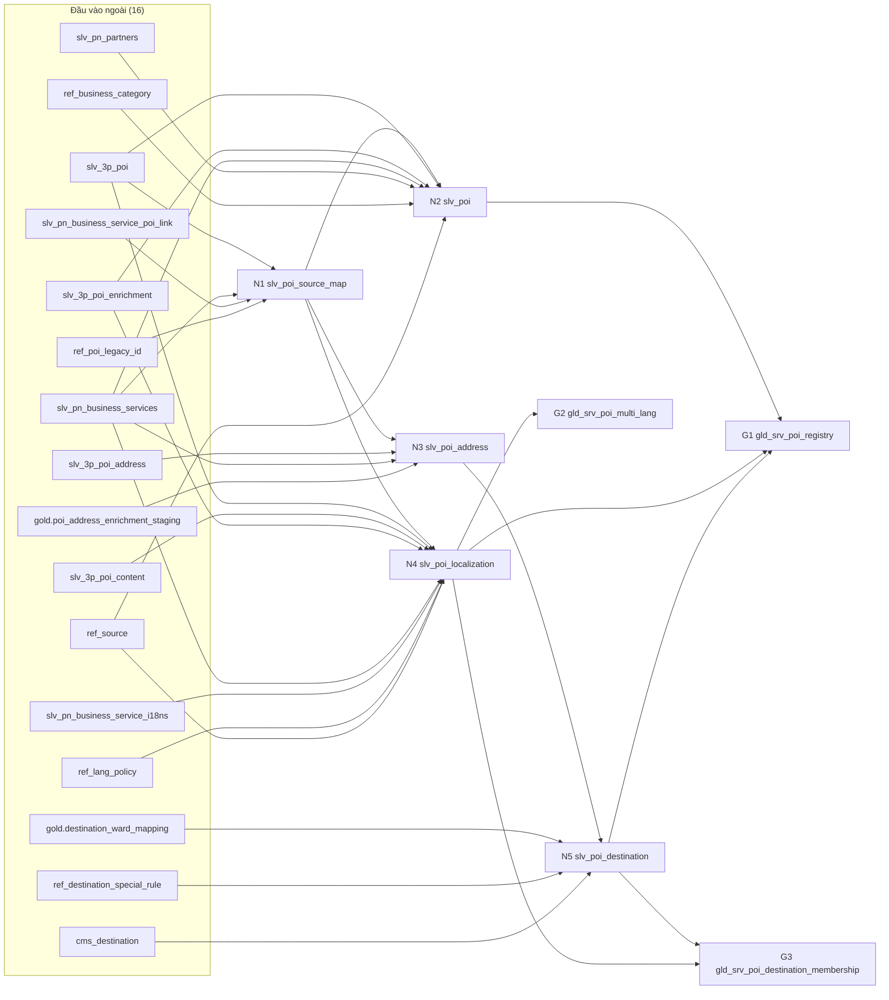

# NB_00_ORCHES_SLV_TO_GLD — Điều phối luồng tính lại silver → silver L2 → gold

> Cập nhật: 08/10/2026. Bản code: `claude/NB_00_ORCHES_SLV_TO_GLD.ipynb` (project, 05/10). Toàn bộ logic nằm ở `orchestrate()` của `NB_LIB_TRANSFORM_SLV_GLD` (xem `NB_LIB_TRANSFORM_SLV_GLD.md` §7).
> Thiết kế: `claude/GOLD_POI_FLOW_DESIGN.md` §5, §11, §12. Không nhầm với `NB_00_POI_PIPELINE_ORCHESTRATOR` (chuỗi 3P cũ, vẫn chạy song song).

## 1. Mô tả

1 notebook điều phối dùng chung cho **mọi** luồng tính lại: chọn luồng bằng `p_pl_name`, DAG dựng từ `ctrl_mng_pipeline_config` (cạnh `load_mode = 'RECOMPUTE'`), **không viết cứng** notebook / bảng nào. Mỗi lần chạy: khoá luồng → lập kế hoạch (cạnh nào có dữ liệu mới) → chốt version đầu vào ngoài → chạy các node cần chạy bằng `notebookutils.notebook.runMultiple` theo phụ thuộc → đọc kết quả node từ log → ghi dấu đã đọc của cạnh → đóng run log, nhả khoá.

NB_00 là nơi **duy nhất** ghi `ctrl_mng_watermark` (cạnh) và `ctrl_log_run` của luồng; node chỉ append `ctrl_log_table_run` của mình.

| | |
|---|---|
| Gọi bởi | Pipeline `PL_VV_TRANSFORM_SLV_TO_GLD_1H` (1 Notebook activity) |
| Luồng hiện có | `PL_VV_TRANSFORM_SLV_TO_GLD_1H`: 8 node, 33 cạnh, 16 đầu vào ngoài |
| Đọc | `ctrl_mng_pipeline_config`, `ctrl_mng_watermark`, `ctrl_log_run` (ghim theo batch extract, lát cắt pl khác), `ctrl_log_table_run` (kết quả node), `DeltaTable.history()` + `DESCRIBE DETAIL` mọi đầu vào và node |
| Ghi | `ctrl_mng_watermark` (dòng khoá, 33 dòng cạnh), `ctrl_log_run` (1 dòng / lần chạy); bảng đích do node ghi |
| Lỗi | Node lỗi → run `PARTIAL_FAILED`, notebook raise (pipeline báo lỗi); lần sau chỉ chạy lại phần còn bẩn |

## 2. Ý nghĩa

| Trước (chuỗi NB_00 cũ / 2.1) | NB_00 mới |
|---|---|
| Thứ tự notebook viết cứng; chạy hết mỗi lần | DAG từ config; chỉ chạy node có đầu vào đổi + hậu duệ |
| Biết "có dữ liệu mới" bằng giờ / watermark nguồn | So version Delta của **từng bảng đầu vào** với version đã đọc; bỏ commit bảo trì |
| Lỗi giữa chừng phải chọn bước chạy lại | Cạnh của node lỗi không tiến → lần sau tự chạy lại đúng phần thiếu |
| Mỗi luồng 1 orchestrator | Thêm luồng = dòng config + notebook node + 1 pipeline gọi NB_00 với `p_pl_name` mới |
| Đọc bảng extract đang ghi dở | Ghim version của batch extract hoàn tất gần nhất |

## 3. Tham số

| Tham số | Mặc định | Ý nghĩa |
|---|---|---|
| `p_pl_name` | (bắt buộc) | pl cần chạy, vd `PL_VV_TRANSFORM_SLV_TO_GLD_1H`; nhịp đọc từ hậu tố `_15M` / `_1H` / `_1D` |
| `p_run_id` | "" | `@pipeline().RunId`; trống = `exec_id` |
| `p_mode` | `RUN` | `RUN`; `PLAN` = chỉ in kế hoạch + DAG runMultiple, **không khoá, không ghi**; `DRY_RUN` = node tính + QG + đếm diff, không ghi bảng đích, không tiến cạnh (vẫn khoá + ghi run log) |
| `p_max_parallel` | 3 | Node chạy cùng lúc (runMultiple `concurrency`), 1–8 |
| `p_node_timeout_min` | 20 | Timeout 1 node (`timeoutPerCellInSeconds`; cell `run_node` là cell dài nhất), ≤ DAG |
| `p_dag_timeout_min` | 45 | Timeout cả DAG (`timeoutInSeconds`) |
| `p_lock_timeout_min` | 90 | Hạn khoá của lần chạy này, ghi vào dòng khoá lúc nhận; run khác chỉ lấy lại khoá khi đã qua hạn này. **Phải > `p_dag_timeout_min` + 5**; timeout activity pipeline phải nhỏ hơn |
| `p_force_nodes` | "" | `trg_tbl` ép chạy (bỏ qua hộp thư) + hậu duệ, vd sau khi sửa tay bảng đích |
| `p_history_limit` | 1000 | Số commit tối đa đọc khi xét 1 đầu vào; vượt → cạnh coi là bẩn (`HISTORY_GAP`). Vd cạnh đã đọc v100, bảng nay v1.250 → cần 1.150 commit > 1000 → tính lại cho chắc |
| `p_non_data_ops` | "" | Ghi đè danh sách operation không đổi dữ liệu (CSV); trống = `DEFAULT_NON_DATA_OPS` |

Tham số truyền dạng chuỗi; `_validate_orch_params` kiểm tra miền giá trị trước khi làm gì (sai → `ConfigError` liệt kê hết).

## 4. Cấu trúc notebook

| Cell | Nội dung |
|---|---|
| 1 | Markdown mô tả + bảng tham số |
| 2 | Tham số (`parameters`) |
| 3 | `%run NB_LIB_TRANSFORM_SLV_GLD` |
| 4 | `RUN_SUMMARY = orchestrate(p_pl_name=…, …)`; `print(json_dumps(RUN_SUMMARY))` |

Notebook không có hàm riêng.

## 5. Luồng `orchestrate()`

```
[0] _validate_orch_params                         PLAN: plan_run → print_plan → DAG runMultiple (in) → trả, không khoá / ghi
[1] ensure_lock_row(wm_flow__<pl>) → acquire_flow_lock(hạn = now + p_lock_timeout_min)
      không được → append run log SKIPPED_CONCURRENT, trả (không raise)
    close_stale_runs: run RUNNING khác quá hạn → ABANDONED (sau khi đã giữ khoá)
[2] append run log RUNNING (read_mode = VERSION_INBOX)
[3] plan_run:
      build_dag (kiểm tra 1 chủ, chu trình, nhịp) → table_state mọi bảng
      → external_pins: node pl khác = output_versions_json; bảng extract có batch dở = version trước batch
      → edge_status từng cạnh (HistoryCache) → ứng viên = (bẩn ∪ chưa có bảng ∪ force) + hậu duệ
    không ứng viên → NO_DATA (RUN: output_versions = version hiện tại các node)
[4] build_run_multiple_dag → notebookutils.notebook.runMultiple(dag)   lỗi runMultiple không dừng NB_00
[5] collect_outcomes: dòng ctrl_log_table_run của exec; node không có dòng → NOT_RUN
[6] RUN: advance_edges — node SUCCESS / NO_DATA: cạnh = version node đã đọc (kể cả lùi); node lỗi: ghi trạng thái
      chỉ khi còn giữ khoá (kiểm tra trước, điều kiện EXISTS trong MERGE, kiểm tra sau)
[7] finally: update run log (status, counts, read_note = tóm tắt kế hoạch, output_versions_json khi SUCCESS) → release_flow_lock
    status ∉ (SUCCESS, NO_DATA) → raise RuntimeError
```

Trạng thái run: `SUCCESS` (mọi ứng viên OK), `NO_DATA` (không ứng viên), `PARTIAL_FAILED` (có node `FAILED` / `SKIPPED` / `NOT_RUN`), `FAILED` (lỗi của chính NB_00), `SKIPPED_CONCURRENT`.

## 6. DAG luồng 1H



Tầng: N1 (0) → N2, N3, N4 (1) → N5, G2 (2) → G1, G3 (3). Với `p_max_parallel = 3`, tầng 1 chạy cùng lúc.

## 7. Pipeline `PL_VV_TRANSFORM_SLV_TO_GLD_1H`

| Mục | Giá trị |
|---|---|
| Activity | 1 Notebook activity `NB_00_ORCHES_SLV_TO_GLD` |
| Tham số | `p_pl_name = PL_VV_TRANSFORM_SLV_TO_GLD_1H`, `p_run_id = @pipeline().RunId`; còn lại mặc định |
| Timeout activity | 75 phút (< `p_lock_timeout_min` 90, > `p_dag_timeout_min` 45) |
| Retry | 0 |
| Concurrency | 1 |
| Lịch | 1 giờ, lệch đỉnh extract (2 session extract đã chiếm 32 VCore lúc wave trên F16 dùng chung) |
| Precheck | Chưa làm (OD-G8: giai đoạn 1 gọi thẳng NB_00) |

## 8. Kết quả đã chạy

| Lần | Kết quả |
|---|---|
| Run 1 (05/10, exec `c8d4218f`) | 373 s; 8 node SUCCESS; số dòng build: N1 19.070 · N2 19.070 · N3 19.070 · N4 57.200 · N5 22.298 · G2 57.198 · G3 22.293 · G1 19.066. Cạnh đọc v1 của mọi đầu vào L1 / ref (tạo lại 04/10), `poi_address_enrichment_staging` @26, `destination_ward_mapping` @29, `cms_destination` @8. Dòng khoá SUCCESS, khoá NULL |
| Lần chạy lại (kỳ vọng `NO_DATA`) | Phần lập kế hoạch ~93 s (đọc history + DESCRIBE DETAIL tuần tự ~24 bảng); chờ log đầy đủ để xác nhận phát hiện OPTIMIZE / auto compaction là `MAINTENANCE_ONLY` |

## 9. Runbook

| Tình huống | Làm |
|---|---|
| Lần đầu | `NB_SETUP_GOLD_POI_1H` (`p_apply=false` → đọc → `true`) → NB_00 `PLAN` (kỳ vọng 8 ứng viên, 33 cạnh `NEW_EDGE`) → `RUN` → `RUN` lần 2 (kỳ vọng `NO_DATA`) → bật lịch |
| Node FAILED | Đọc `ctrl_log_table_run.error_message` / `qg_json` của `exec_id` mới nhất; sửa dữ liệu / ref; lần sau tự chạy lại |
| Tính lại 1 node | `p_force_nodes = <trg_tbl>` (node + hậu duệ) |
| Tạo lại / nạp lại bảng silver đầu vào | **Tạm dừng lịch** (không chặn theo tỉ lệ); xong chạy NB_00 (table id khác → tự tính lại) |
| Đầu vào bắt buộc rỗng | QG chặn node, gold không bị xoá mềm |
| Khoá kẹt (NB_00 chết) | Tự hết hạn theo hạn ở dòng khoá (lúc nhận + 90'); run RUNNING quá hạn → `ABANDONED` |
| Log `LockLostError` | Run khác đã lấy khoá; chạy NB_00 với `p_force_nodes` = node của run cũ |
| Log `ghim: … extract … dở từ …` | Extract đang chạy / lỗi giữa chừng: gold đọc batch hoàn tất gần nhất; extract thành công lần sau → gold tự đọc bản mới |
| Gỡ luồng | `UPDATE ctrl_mng_pipeline_config SET is_active = 0 WHERE pl_name = 'PL_VV_TRANSFORM_SLV_TO_GLD_1H'`; tắt pipeline |
| Thêm luồng (vd `_15M`) | Notebook node (`NodeSpec` + `build`) → dòng config `RECOMPUTE` với `pl_name` mới (dòng watermark cạnh tự tạo lần đầu) → pipeline mới gọi NB_00 với `p_pl_name` mới. Luồng nhanh không được đọc node của luồng chậm; node của luồng khác đọc theo `output_versions_json` |

```sql
-- Lần chạy gần nhất
SELECT exec_id, status, run_mode, started_at, duration_ms, tbl_total_count, tbl_success_count, tbl_failed_count,
       tbl_no_data_count, error_message, read_note
FROM lh_vv_bronze.ctrl.ctrl_log_run WHERE pl_name = 'PL_VV_TRANSFORM_SLV_TO_GLD_1H' ORDER BY started_at DESC LIMIT 5;
-- Node của 1 lần chạy
SELECT trg_tbl, status, entity_rows, inserted_rows, updated_rows, deactivated_rows, duration_ms, error_message, qg_json
FROM lh_vv_bronze.ctrl.ctrl_log_table_run WHERE exec_id = '<exec_id>' ORDER BY priority, trg_tbl;
```

## 10. Việc còn mở

| # | Việc |
|---|---|
| 1 | Chạy `CHECK_PIN_EXTRACT_0510.py` (múi giờ `started_at` extract vs commit Delta) trước khi tin ghim theo batch extract |
| 2 | `[VERIFY]` runMultiple trên Fabric (tên trường, node con bị bỏ qua khi cha lỗi, gọi từ notebook do pipeline chạy, 3 node cùng lúc trên F16) |
| 3 | Giảm thời gian PLAN (~93 s): đọc `table_state` / history song song hoặc cache table id |
| 4 | Precheck cho pipeline 1H (giống FL_00, §5.7 thiết kế) |
| 5 | Chạy song song 2 tuần + so khớp với `poi_master` cũ theo `legacy_poi_id` trước khi chuyển sync PG |
